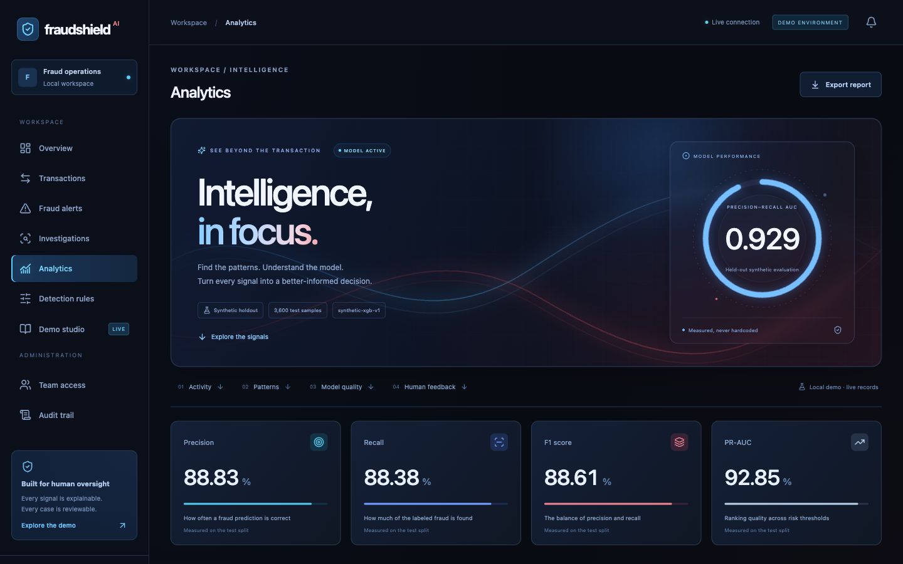
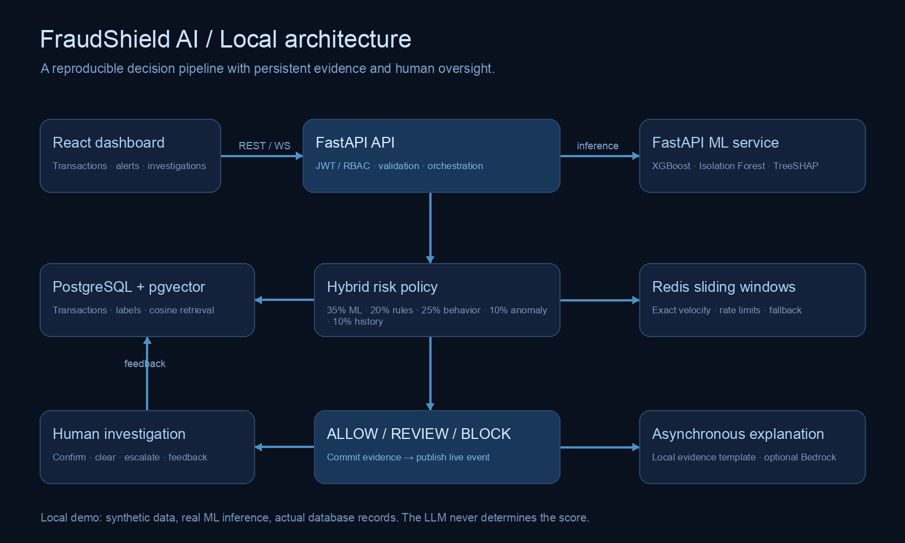

<div align="center">

# FraudShield AI

### Real-time fraud intelligence. Explainable decisions. Human oversight.

A complete local demonstration of fraud detection in digital lending—combining machine learning, behavioral analysis, configurable rules, historical pattern retrieval, and an analyst investigation workflow.

**React · TypeScript · FastAPI · XGBoost · PostgreSQL · pgvector · Redis · Docker**

[Quick start](#quick-start) · [Demo walkthrough](#demo-walkthrough) · [Architecture](#architecture) · [Testing](#testing) · [Presentation materials](#presentation-materials)

</div>



## Quick start

**Prerequisite:** [Docker Desktop](https://www.docker.com/products/docker-desktop/) with Docker Compose v2, or Docker Engine with Compose v2 on Linux. Allow approximately 3 GB of free disk space. Git is needed to clone the repository.

```bash
git clone https://github.com/ParvG2005/Real-Time-Fraud-Detection.git
cd Real-Time-Fraud-Detection
./start
```

**After cloning, `./start` is the only command needed on macOS/Linux.** It:

1. Generates unique local credentials and service secrets, preserving existing configuration.
2. Builds the frontend and both Python services, installing their dependencies inside Docker.
3. Trains the reproducible synthetic ML models.
4. Starts PostgreSQL/pgvector, Redis, the ML service, the API, and the dashboard.
5. Applies database migrations and seeds realistic, explicitly synthetic demo activity.
6. Waits for backend dependencies to become healthy, prints your login details, and opens the dashboard where supported.

**No local Node.js, Python, Java, database installation, or AWS account is required.** If Python is unavailable, the launcher uses a small Python container to generate configuration. The first build requires internet access and may take several minutes. Subsequent runs reuse the local images and data; the running demo is offline-capable.

| Platform | One-command startup after cloning |
|---|---|
| macOS / Linux | `./start` |
| Windows PowerShell | `powershell -ExecutionPolicy Bypass -File .\start.ps1` |
| macOS Finder | Double-click `Start Demo.command` |

Open **http://localhost:3000** and use the email/password printed by the launcher. Credentials are stored in the gitignored `.env`. API documentation is available at **http://localhost:8080/docs**.

```bash
./stop                  # Stop the stack and preserve all records
./start                 # Resume the stack with the same credentials and data
docker compose logs -f  # Inspect service logs
```

The macOS/Linux path has been exercised in this workspace. The Windows PowerShell launcher is provided but has not been executed on a Windows host.

## What you can demonstrate

- **Real-time detection:** actual submitted transactions are evaluated, persisted, and streamed to the dashboard.
- **Hybrid risk scoring:** XGBoost predictions, configurable rules, behavior, anomaly percentiles, and historical similarity contribute to an explicit policy decision.
- **Model explainability:** genuine TreeSHAP contributions, captured input features, triggered rules, and evidence-based explanations.
- **Historical retrieval:** real cosine similarity queries against confirmed cases stored in pgvector.
- **Human investigation:** confirm fraud, mark legitimate, escalate, record notes, and export labeled feedback.
- **Interactive analytics:** animated metrics, scroll reveals, time-range controls, decision charts, pattern grouping, model evaluation, feature shifts, and feedback counts.
- **Access control:** ADMIN, ANALYST, and VIEWER roles, protected write operations, and an audit trail.
- **Failure handling:** an ML outage forces at least REVIEW; Redis outages use PostgreSQL velocity history and local-demo rate limiting.

The UI respects reduced-motion preferences. Charts and counters are driven by API data; no results or performance metrics are hardcoded into the dashboard.

## Demo walkthrough

The **Demo studio** creates a fresh synthetic customer for each run, making the sequence repeatable without resetting the database.

| Scenario | Inputs | Expected default-policy result |
|---|---|---|
| Everyday repayment | ₹2,500; familiar device and city | ALLOW |
| Unusually high amount | ₹50,000; familiar device; ₹2,500 baseline | REVIEW |
| Account takeover pattern | ₹65,000; new device; new city; seven actual prior requests in five minutes | BLOCK |
| Unusual but legitimate payment | Suspicious signals followed by independent analyst verification | Flagged, then labeled LEGITIMATE |

1. Open **Overview** in one tab and **Demo studio** in another.
2. Run the normal repayment and watch the overview update live.
3. Run the high-amount and takeover scenarios.
4. Select **Investigate this transaction** and inspect the component scores, history, TreeSHAP, and similar cases.
5. Write an investigation note and select **Confirm fraud**.
6. Run the fourth scenario and select **Mark legitimate** to demonstrate the false-positive feedback loop.
7. Visit **Analytics**, then export feedback from **Investigations**.

Scores are calculated at runtime. Time-of-day, policy edits, and accumulated confirmed cases can change them. The original policy decision is preserved when an analyst changes the investigation label.

## Architecture



| Service | Responsibility |
|---|---|
| `frontend` | React/TypeScript dashboard served by Nginx; REST and WebSocket proxy |
| `backend` | FastAPI API, authentication, feature engineering, policy, investigations and persistence |
| `ml-service` | XGBoost and Isolation Forest inference, TreeSHAP, embeddings and explanation adapters |
| `postgres` | Transaction evidence, policies, cases, feedback, audit records and pgvector retrieval |
| `redis` | Sliding-window velocity state and rate limiting |

The main API uses **FastAPI**, following the implementation preference that superseded the original Java/Spring Boot section in `Spec.md`.

### Decision pipeline

1. Authenticate, authorize, validate, and apply an optional idempotency key.
2. Serialize the customer's evaluation using a PostgreSQL advisory lock.
3. Derive features from prior committed activity and Redis sliding windows.
4. Evaluate the trained model, rules, behavior, anomaly detector, and historical matches.
5. Aggregate the signals and persist the decision with its complete evidence snapshot.
6. Notify authenticated dashboard connections after the commit.
7. Generate the explanation asynchronously and retain human feedback for later evaluation.

Default weights are **35% ML + 20% rules + 25% behavior + 10% anomaly + 10% history**. Policy thresholds are **ALLOW <40**, **REVIEW 40–69.99**, and **BLOCK ≥70**. These are transparent demonstration choices, not calibrated financial probabilities or industry-standard weights. Each transaction retains the policy weights used at evaluation time.

The public API accepts transaction facts, not client-supplied scores or model features. Server receive time is authoritative. Supported demo currency: INR.

## Machine learning and evaluation

Training generates 18,000 synthetic examples with overlapping classes and stochastic labels. A stratified **60/20/20 train/validation/test split** separates model selection from final evaluation. Class weighting uses only the training data. Isolation Forest is trained on legitimate training examples.

| Measured synthetic holdout metric | Result |
|---|---:|
| Precision | 88.83% |
| Recall | 88.38% |
| F1 | 88.61% |
| PR-AUC | 0.9285 |
| ROC-AUC | 0.9779 |
| False positive rate | 1.37% |
| False negative rate | 11.62% |

These values were produced by the training pipeline, not copied from the specification. The API serves the generated metrics artifact. **Synthetic holdout performance does not establish real-world lending performance or fraud prevalence.** Analyst-reviewed feedback is shown separately because it is a selected subset.

TreeSHAP values are in **log-odds**. Their sum plus the base value reconstructs the model margin; tests verify the corresponding probability. The Isolation Forest output is a percentile against its training reference, not a fraud probability.

Read the [model card](docs/model.md) for feature definitions, training details, evaluation limits, and future production requirements.

## Local AI mode

The default configuration makes **no cloud calls** and needs no API keys.

- **Retrieval:** normalized 256-dimensional text-hashing vectors queried through pgvector. This is lexical pattern similarity, not a neural semantic embedding model.
- **Explanation:** grounded local evidence templates, explicitly labeled as such. They are **not LLM-generated text**.
- **Optional Bedrock adapter:** structured, asynchronous explanation support and Titan embeddings are implemented for future experimentation. Live AWS execution was not tested in this local setup.

An LLM never controls scores or policy decisions. Human confirmation adds a case to future retrieval; marking it legitimate or reopening it withdraws it from confirmed-fraud retrieval. Feedback is exportable but does not automatically retrain or replace the model.

## Security and reliability

- JWT authentication with one-hour expiry; bcrypt password hashing.
- Role checks enforced by the API, including direct requests outside the UI.
- Strict Pydantic validation, allowlisted rule features/operators, and bound SQL parameters.
- Optional IP addresses are HMAC-hashed; raw IPs are not retained or returned.
- Idempotency keys reject conflicting retries and return the original result for identical requests.
- Per-customer advisory locks prevent concurrent velocity undercounting.
- PostgreSQL is the source of truth; Redis state can be reconstructed.
- Audit events record access, policy changes, account administration and investigation decisions.
- Browser tokens are sent in the initial WebSocket message, not in URL query strings.
- Local secrets are generated in `.env`; Docker ports are bound to localhost.

This is a **local demonstration**, not a production financial service. It moves no funds, determines no creditworthiness, and permanently bans no customers. Explanations and WebSocket delivery use one API process; production would require durable jobs, shared events, representative data validation, calibration, operational controls, and fairness assessment.

## Testing

The application has been exercised against the running Docker stack, including visible browser tests.

| Layer | Coverage |
|---|---|
| Policy/model tests | Threshold boundaries, rule toggles, weight validation, real inference, SHAP additivity, embeddings and ML API validation |
| Live API checks | All four scenarios, persistence, feedback, idempotency, concurrency, RBAC, rule CRUD and analytics |
| Headful browser suites | Actual user flows, cross-tab live updates, mobile layout, permissions, dependency outages and recovery |
| Analytics interaction tests | Scroll reveals, counters, API-matched totals, range/group controls, tooltips, exports and reduced-motion behavior |

For development/testing, install Node.js and Python 3 on the host:

```bash
npm --prefix frontend ci
(cd frontend && npx playwright install chromium)
bash scripts/test.sh

# Watch the full browser suite in a real browser window
(cd frontend && HEADED=1 npm run test:e2e -- --headed)

# Watch only the analytics and animation tests
(cd frontend && HEADED=1 npm run test:e2e -- --headed analytics-motion.spec.ts)
```

Tests create synthetic activity and temporary viewer accounts. Fault-drill tests temporarily stop **only this project's** ML and Redis containers, then restore them in cleanup blocks. Run them when no other person is presenting the same local instance. Details: [verification record](docs/TESTING.md).

## Development

```bash
# Start the complete local stack first
./start

# Run a frontend development server with API/WebSocket proxying
cd frontend
npm ci
npm run dev
```

The production dashboard remains on port 3000; Vite uses port 5173. Both connect to the API on port 8080. PostgreSQL is available locally on port 5433. Redis and the ML service are internal to the Compose network.

To rebuild a changed service: `docker compose up -d --build backend` or `docker compose up -d --build frontend`. Training runs during the ML image build; rebuild it with `docker compose build --no-cache ml-service` when changing the training pipeline.

### Configuration

| Variable | Purpose |
|---|---|
| `ADMIN_EMAIL`, `ADMIN_PASSWORD` | Initial administrator account |
| `POSTGRES_DB`, `POSTGRES_USER`, `POSTGRES_PASSWORD` | Local persistence configuration |
| `JWT_SECRET`, `ML_SERVICE_TOKEN` | Generated authentication/service secrets |
| `DEMO_ENABLED` | Enable startup seed and demo simulation endpoints |
| `RISK_WEIGHTS` | Five comma-separated weights: ML, rules, behavior, anomaly, history; must sum to 1 |
| `BEDROCK_ENABLED` | `false` by default; optional cloud explanations |
| `EMBEDDING_PROVIDER` | `local` by default; optional `bedrock` |
| `DOCKER_SUBNET` | Override the default dedicated `10.246.82.0/24` network if needed |

The environment template is [`.env.example`](.env.example). Existing administrator passwords are not silently changed when `.env` is edited after initialization. If experimenting with Bedrock, use the standard AWS credential provider chain and the documented model/region variables; do not put credentials in prompts. Vectors are filtered by provider, so switching embedding models requires re-embedding reference cases.

## Troubleshooting

| Symptom | Resolution |
|---|---|
| Docker cannot connect | Start Docker Desktop/daemon and rerun `./start`. macOS startup attempts to open Docker Desktop automatically. |
| First startup is slow | Image downloads, dependency installation and frontend/model builds run once. Inspect `docker compose logs` for startup errors. |
| Port already allocated | Free ports 3000, 8080 or 5433, or adjust the corresponding host mapping in `docker-compose.yml`. |
| Network subnet conflict | Set an unused `DOCKER_SUBNET` in `.env` and recreate this project's containers/network. |
| Login details unavailable | Read `ADMIN_EMAIL`/`ADMIN_PASSWORD` in `.env`, or rerun `./start` to display them. |
| Browser session expired | Sign in again; tokens last one hour. |
| Scenario produces a different score | Check detection-rule changes, time-of-day and saved historical cases. Scores are calculated, not fixed examples. |
| ML service unavailable | The transaction enters at least REVIEW with a visible degraded explanation. Inspect `docker compose logs ml-service`. |

`./stop` preserves database volumes. **`docker compose down -v` deletes the local database and Redis volumes**; use it only when deliberately resetting the entire demo.

## Presentation materials

- [Seven-minute presentation script and interview Q&A](docs/PRESENTATION.md)
- [Editable 14-slide PowerPoint](docs/FraudShield-Presentation.pptx)
- [Presentation PDF](docs/FraudShield-Presentation.pdf)
- [Captioned recording of the application](docs/recorded-demo.webm)
- [API reference](docs/API.md) and live [OpenAPI documentation](http://localhost:8080/docs)
- [Database and consistency notes](docs/database.md)
- [Model card](docs/model.md) and [specification coverage](docs/SPEC_COVERAGE.md)

Build a portable source ZIP with `python3 scripts/package.py`; the output is `artifacts/fraudshield-ai.zip`. Credentials, installed dependencies and test traces are excluded.

The dashboard's original visual design takes inspiration from [MotionSites](https://motionsites.ai/). It uses local CSS/SVG and native browser animation APIs; no paid template, hosted font or remote animation service is required.

## Repository structure

```text
frontend/       React dashboard, motion components, browser tests
backend/        FastAPI orchestration, auth, policy, investigations
ml-service/     Training, inference, TreeSHAP, retrieval/explanation adapters
database/       Versioned PostgreSQL/pgvector migrations
docs/           Architecture, screenshots, slides and technical guides
scripts/        Startup, verification, recording and packaging utilities
start           One-command macOS/Linux launcher
start.ps1       One-command Windows PowerShell launcher
docker-compose.yml
.env.example
Spec.md         Original specification, preserved unchanged
```

Future extensions include representative real-data validation, calibrated thresholds, durable event/job infrastructure, a model registry, approximate vector indexes, and graph-based fraud investigation. These are explicitly future work, not current demo claims.
